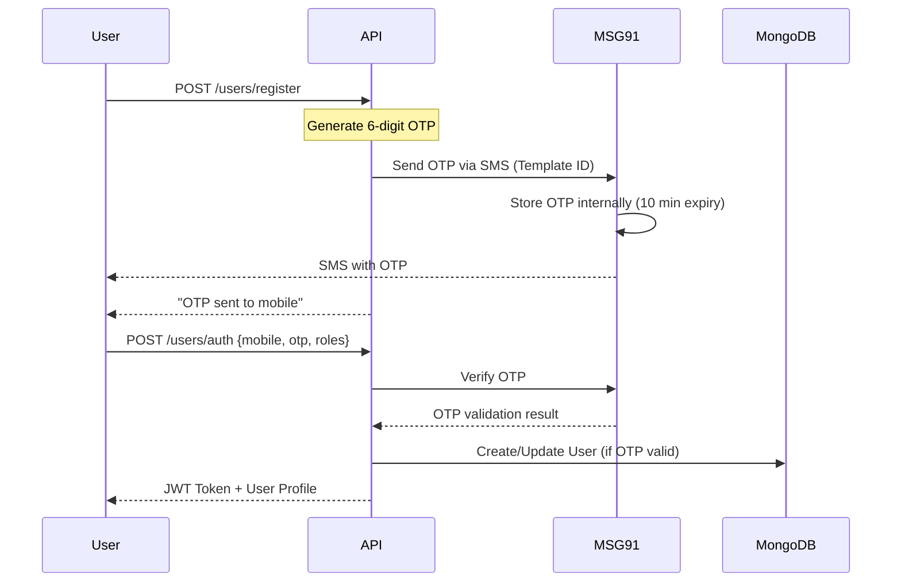
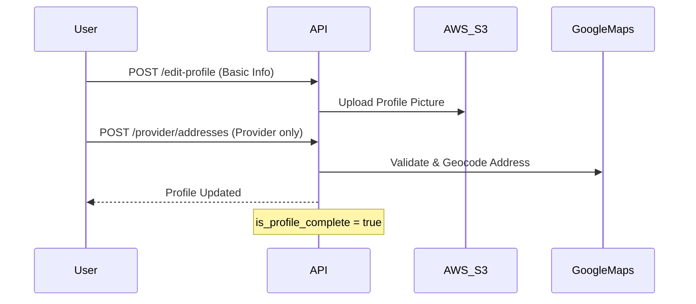
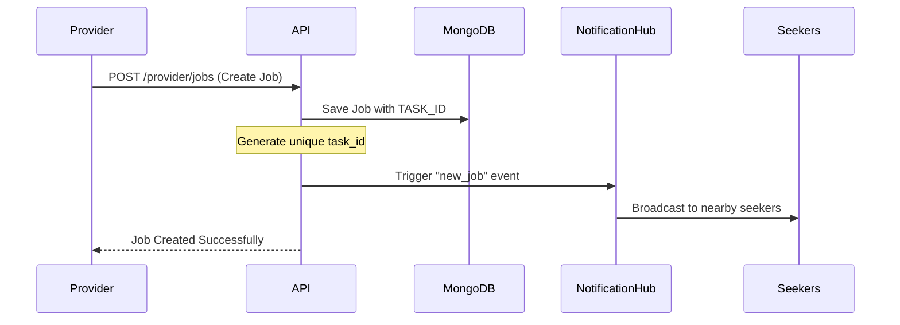
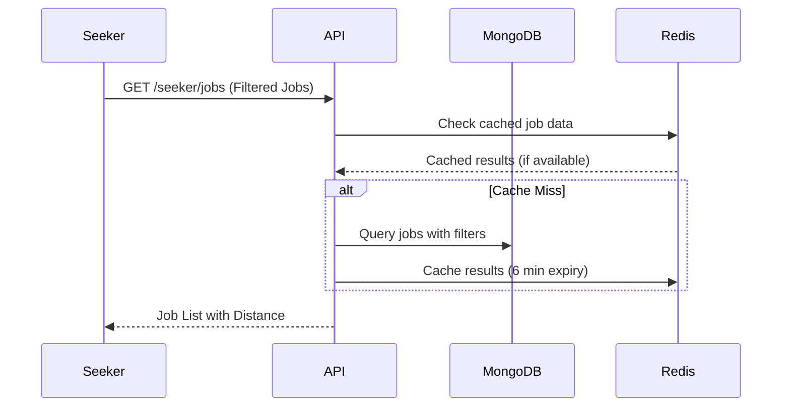
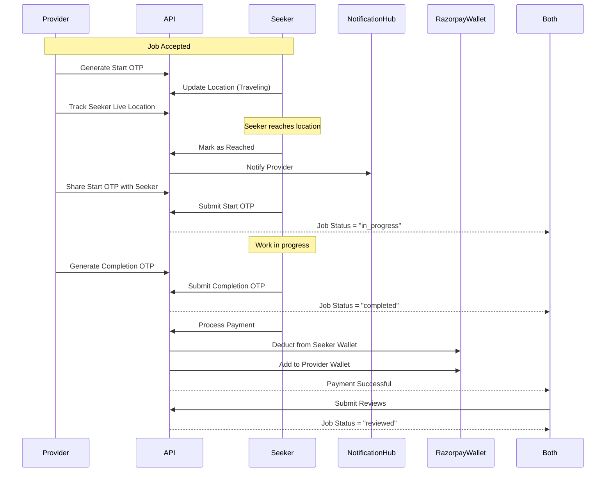
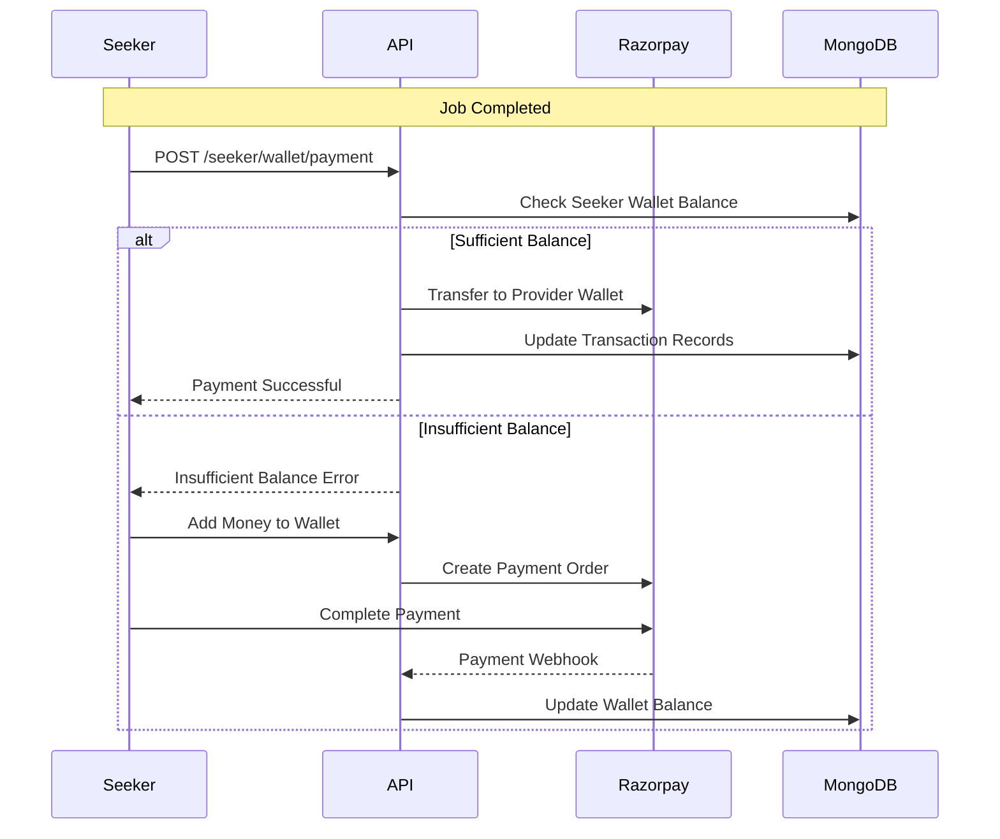
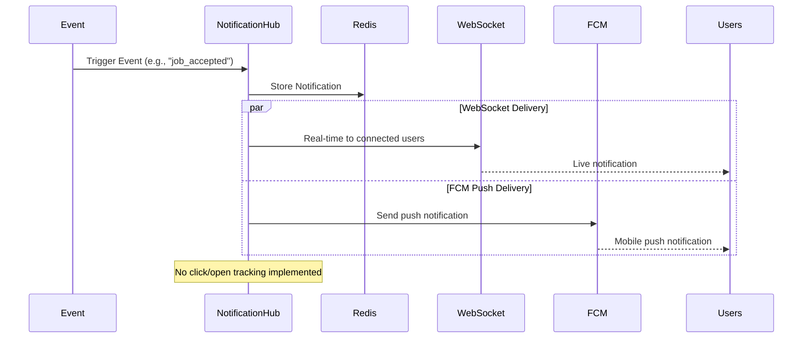
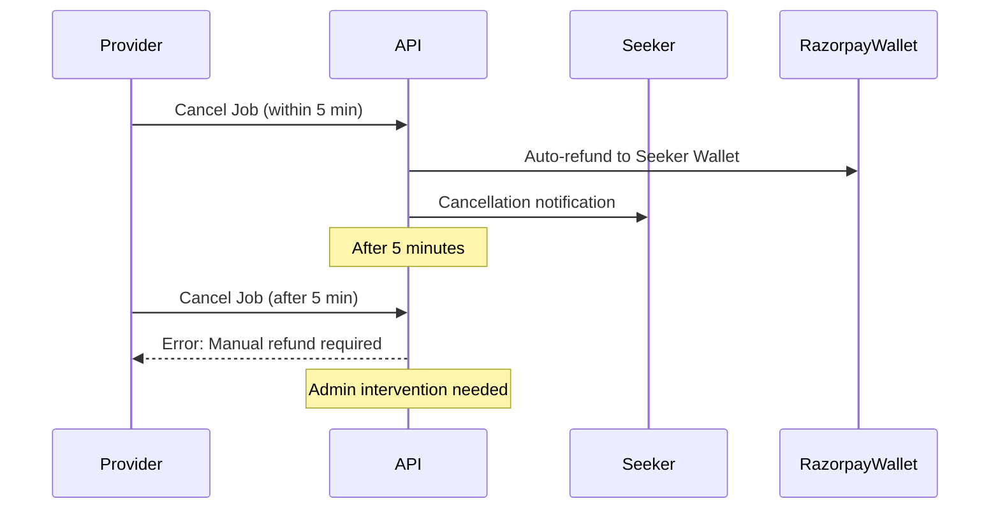

# Application Flow Documentation

## Overview
Workerlly is a job marketplace connecting **Providers** (job creators) with **Seekers** (job applicants). The platform handles the complete job lifecycle from creation to payment with real-time tracking and OTP-based verification.

### Core Architecture
- **Frontend**: Two separate mobile applications (Provider & Seeker)
- **Backend**: FastAPI with MongoDB, Redis, Firebase FCM
- **Authentication**: MSG91 OTP-based authentication
- **Payment**: Razorpay integration with wallet management
- **Real-time**: WebSocket + Firebase push notifications

## Complete User Journey

### 1. User Registration & Authentication

#### Phone Number Registration (MSG91 OTP)


**Actual Endpoints:**
```http
# Send Registration OTP
POST /api/v1/users/register
{
    "mobile": "9876543210",
    "roles": ["provider", "seeker"]
}

# Response
{
    "message": "OTP sent to mobile"
}

# Verify OTP & Authenticate
POST /api/v1/users/auth
{
    "mobile": "9876543210",
    "otp": "123456",  // OTP sent by MSG91
    "roles": ["provider", "seeker"]
}

# Response
{
    "access_token": "eyJhbGciOiJIUzI1NiIsInR5cCI6IkpXVCJ9...",
    "token_type": "bearer"
}
```

#### Profile Completion Flow


### 2. Provider Flow (Job Creator)

#### Address Management
```http
# Add Address with Google Maps Integration
POST /provider/addresses
{
    "address_line": "123 Main Street",
    "city": "Bangalore", 
    "state": "Karnataka",
    "pincode": "560001",
    "country": "India",
    "latitude": 12.9716,
    "longitude": 77.5946,
    "address_type": "home|work|other",
    "is_default": true
}

# Update Address
PUT /provider/addresses/{address_id}

# Get All Addresses  
GET /provider/addresses
```

#### Job Creation & Management


**Job Creation:**
```http
POST /provider/jobs
{
    "title": "Plumber Needed",
    "description": "Fix kitchen sink",
    "category_id": "cat_123",
    "subcategory_id": "subcat_456", 
    "urgency": "normal|urgent",
    "estimated_duration": 120,  // minutes
    "budget_min": 500,
    "budget_max": 1000,
    "skills_required": ["plumbing", "pipe_repair"],
    "address_id": "addr_789",  // From provider addresses
    "additional_requirements": "Bring own tools"
}

# Response includes generated task_id
{
    "job_id": "job_123",
    "task_id": "TSK789012",  // Displayed to users
    "status": "created"
}
```

#### Bid Management
```http
# Get Job Applications/Bids
GET /provider/jobs/{job_id}/bids
{
    "filters": {
        "status": "pending|accepted|rejected",
        "rating_min": 4.0,
        "distance_max": 10  // km
    }
}

# Accept Bid (1-to-1 job model)
POST /provider/jobs/{job_id}/accept-bid
{
    "bid_id": "bid_123",
    "message": "Please come at 2 PM"
}
```

### 3. Seeker Flow (Job Applicant)

#### Job Discovery


**Job Search & Filtering:**
```http
GET /seeker/jobs
Query Parameters:
    - category_id: "cat_123"
    - subcategory_id: "subcat_456"
    - urgency: "normal|urgent"  
    - budget_min: 500
    - budget_max: 2000
    - radius: 5  // km from seeker location
    - skills: ["plumbing", "electrical"]
    - sort_by: "distance|budget|created_at"
    - page: 1
    - limit: 20

# Response includes calculated distance
{
    "jobs": [
        {
            "job_id": "job_123",
            "task_id": "TSK789012",
            "title": "Plumber Needed",
            "distance_km": 2.5,
            "estimated_duration": 120,
            "budget_range": "₹500 - ₹1000",
            "urgency": "normal",
            "address": {
                "area": "Koramangala",
                "city": "Bangalore"
            }
        }
    ]
}
```

#### Bidding Process
```http
# Submit Bid
POST /seeker/jobs/{job_id}/bid
{
    "bid_amount": 750,
    "message": "I have 5 years experience in plumbing",
    "estimated_duration": 90,  // minutes
    "availability": "2024-01-15T14:00:00Z"
}

# Update Bid (before acceptance)
PUT /seeker/bids/{bid_id}

# Withdraw Bid
DELETE /seeker/bids/{bid_id}
```

### 4. Job Execution Flow

#### Complete Job Lifecycle


#### Location Tracking & OTP Verification
```http
# Seeker Updates Location (Real-time)
POST /seeker/jobs/{job_id}/update-location
{
    "latitude": 12.9716,
    "longitude": 77.5946,
    "timestamp": "2024-01-15T14:30:00Z"
}

# Provider Tracks Seeker Location (WebSocket)
WebSocket: /ws/track-seeker/{job_id}
# Receives real-time location updates

# Mark as Reached
POST /seeker/jobs/{job_id}/reached
{
    "arrival_time": "2024-01-15T14:45:00Z",
    "location": {
        "latitude": 12.9716,
        "longitude": 77.5946
    }
}

# Provider Generates Start OTP
POST /provider/jobs/{job_id}/generate-start-otp
# Returns: {"otp": "123456", "expires_at": "..."}

# Seeker Submits Start OTP
POST /seeker/jobs/{job_id}/start-job
{
    "start_otp": "123456"
}

# Provider Generates Completion OTP  
POST /provider/jobs/{job_id}/generate-completion-otp

# Seeker Submits Completion OTP
POST /seeker/jobs/{job_id}/complete-job
{
    "completion_otp": "654321"
}
```

### 5. Payment & Wallet System

#### Razorpay Wallet Integration


**Payment Processing:**
```http
# Check Wallet Balance
GET /seeker/wallet/balance

# Add Money to Wallet
POST /seeker/wallet/add-money
{
    "amount": 1000,
    "payment_method": "card|upi|netbanking"
}

# Process Job Payment
POST /seeker/wallet/job-payment/{job_id}
{
    "payment_method": "wallet",
    "tip_amount": 50  // optional
}

# Provider Withdrawal
POST /provider/wallet/withdraw
{
    "amount": 500,
    "bank_account_id": "acc_123"
}
```

#### Transaction Flow
```http
# Payment Calculation (Automatic)
{
    "job_amount": 750,
    "platform_fee": 0,      // Currently 0%
    "gst": 135,             // 18% of job_amount  
    "tip": 50,
    "total_deduction": 935, // From seeker wallet
    "provider_earning": 750 // To provider wallet
}
```

### 6. Review & Rating System

#### Bidirectional Reviews
```http
# Provider Reviews Seeker
POST /provider/jobs/{job_id}/review-seeker
{
    "rating": 4.5,
    "review_text": "Good work, on time",
    "review_categories": {
        "punctuality": 5,
        "work_quality": 4, 
        "communication": 4
    }
}

# Seeker Reviews Provider  
POST /seeker/jobs/{job_id}/review-provider
{
    "rating": 4.0,
    "review_text": "Clear instructions, prompt payment",
    "review_categories": {
        "clarity": 4,
        "payment_speed": 5,
        "communication": 4
    }
}

# Get Reviews
GET /reviews/{user_id}
{
    "user_type": "provider|seeker",
    "rating_filter": 4.0,  // minimum rating
    "page": 1,
    "limit": 10
}
```

### 7. Notification System

#### Multi-Channel Notification Flow


**Notification Events:**
```javascript
// Provider Notifications
{
    "new_application": "New job application received",
    "seeker_reached": "Seeker has reached your location", 
    "job_started": "Job work has started",
    "job_completed": "Job has been completed",
    "payment_received": "Payment received successfully",
    "review_received": "New review from seeker"
}

// Seeker Notifications  
{
    "new_job": "New job matching your skills nearby",
    "bid_accepted": "Your bid has been accepted",
    "job_cancelled": "Job has been cancelled by provider",
    "otp_shared": "Start/completion OTP shared",
    "payment_successful": "Payment processed successfully", 
    "review_received": "New review from provider"
}
```

#### WebSocket Connection
```javascript
// Provider WebSocket
const ws = new WebSocket('ws://api.workerlly.com/ws/provider');

ws.onmessage = (event) => {
    const notification = JSON.parse(event.data);
    // Handle notification based on type
    switch(notification.event_type) {
        case 'new_application':
            // Show new application UI
            break;
        case 'seeker_reached':
            // Enable start OTP generation
            break;
    }
};

// Seeker WebSocket  
const ws = new WebSocket('ws://api.workerlly.com/ws/seeker');
```

### 8. Admin Panel Operations

#### Job & User Management
```http
# Admin Dashboard Stats
GET /admin/dashboard/stats
{
    "total_jobs": 1250,
    "active_jobs": 89,
    "total_users": 3400,
    "total_revenue": 125000,
    "jobs_by_status": {
        "completed": 1100,
        "in_progress": 45,
        "cancelled": 105
    }
}

# Manage Jobs
GET /admin/jobs (List all jobs with filters)
PUT /admin/jobs/{job_id}/status (Change job status)
DELETE /admin/jobs/{job_id} (Soft delete)

# Manage Users
GET /admin/users (List all users)
PUT /admin/users/{user_id}/status (Enable/disable user)
POST /admin/users/{user_id}/documents/verify (Verify documents)
```

### 9. Job Cancellation Rules

#### 5-Minute Cancellation Window


**Cancellation Endpoints:**
```http
# Provider Cancellation
POST /provider/jobs/{job_id}/cancel
{
    "reason": "Emergency came up",
    "cancel_type": "automatic|manual"  // Based on time
}

# Seeker Cancellation
POST /seeker/jobs/{job_id}/cancel
{
    "reason": "Found another job"
}

# Check Cancellation Eligibility
GET /provider/jobs/{job_id}/cancellation-info
{
    "can_auto_cancel": true,
    "time_remaining": 180,  // seconds
    "refund_amount": 935
}
```

### 10. Document Management & Verification

#### File Upload System (AWS S3)
```http
# Upload Profile Picture
POST /upload-profile-picture
Content-Type: multipart/form-data
{
    "profile_picture": File
}

# Upload Documents  
POST /upload-documents
{
    "document_type": "aadhar|pan|license|certificate",
    "files": [File1, File2]
}

# Admin Document Verification
PUT /admin/users/{user_id}/documents/{document_id}/verify
{
    "status": "verified|rejected",
    "remarks": "Clear and readable"
}
```

## Data Models & Status Flow

### Job Status Lifecycle
```
CREATED → OPEN → BID_ACCEPTED → IN_PROGRESS → COMPLETED → PAID → REVIEWED
                  ↓
               CANCELLED (with refund rules)
```

### User Status Types
```
ACTIVE: Normal operation
BUSY: Currently working on a job (Seeker only)
OCCUPIED: Provider equivalent of busy
INACTIVE: Temporarily disabled
BLOCKED: Permanently blocked by admin
```

### Application/Bid Status
```
PENDING → ACCEPTED
    ↓
REJECTED/WITHDRAWN
```

## Error Handling & Status Codes

### Common Error Responses
```json
{
    "PROFILE_INCOMPLETE": "Please complete your profile to continue",
    "INSUFFICIENT_BALANCE": "Insufficient wallet balance", 
    "INVALID_OTP": "OTP is invalid or expired",
    "JOB_NOT_AVAILABLE": "Job is no longer available",
    "OUTSIDE_SERVICE_AREA": "Location is outside service area",
    "DOCUMENT_VERIFICATION_PENDING": "Document verification is pending",
    "USER_OCCUPIED": "User is currently busy with another job",
    "CANCELLATION_TIME_EXPIRED": "Cannot auto-cancel after 5 minutes"
}
```

### HTTP Status Codes
- `200`: Success
- `201`: Created successfully
- `400`: Bad request / Validation error
- `401`: Unauthorized / Invalid token
- `403`: Forbidden / Insufficient permissions
- `404`: Resource not found
- `409`: Conflict (e.g., user already exists)
- `422`: Unprocessable entity (business logic error)
- `500`: Internal server error

## Security Features

### Authentication & Authorization
- JWT tokens with 30-day expiry
- MSG91 OTP verification with 10-minute expiry
- Role-based access control (provider/seeker/admin)
- API rate limiting (implementation pending)

### Data Protection
- Address snapshots for immutable job location data
- Soft delete for all critical data
- Audit trails for admin actions
- File upload size limits and type validation

This comprehensive flow documentation reflects the actual implementation found in the Workerlly codebase, including all real endpoints, status codes, and business logic rules. 

# API Flow Examples

Real-world examples of how the APIs work together for common user scenarios.

## User Registration & Onboarding

### 1. Sign Up Flow

**Step 1: Send OTP**
```http
POST /api/v1/auth/send-otp
{
    "phone": "9876543210"
}
```

**Step 2: Register with OTP**
```http
POST /api/v1/auth/register
{
    "full_name": "John Doe",
    "phone": "9876543210",
    "email": "john@example.com",
    "password": "password123",
    "user_type": "seeker",
    "otp": "123456"
}
```

Returns JWT token. User is now registered but profile is incomplete.

**Step 3: Complete Profile**
```http
PUT /api/v1/seeker/profile
Authorization: Bearer <token>
{
    "current_location": "Mumbai, Maharashtra",
    "skills": ["Python", "Django", "React"],
    "experience_years": 3,
    "expected_salary": {
        "min": 60000,
        "max": 90000,
        "currency": "INR",
        "period": "monthly"
    }
}
```

## Job Search to Application

### 1. Search Jobs
```http
GET /api/v1/seeker/jobs?location=Mumbai&skills=Python&experience=mid&page=1
Authorization: Bearer <token>
```

Gets list of matching jobs with relevance scores.

### 2. View Job Details
```http
GET /api/v1/seeker/jobs/60d5ec49b4e1c8a5d8e3f1a2
Authorization: Bearer <token>
```

Full job description, requirements, company info.

### 3. Save Job (Optional)
```http
POST /api/v1/seeker/saved-jobs
Authorization: Bearer <token>
{
    "job_id": "60d5ec49b4e1c8a5d8e3f1a2",
    "notes": "Good fit, competitive salary"
}
```

### 4. Apply for Job
```http
POST /api/v1/seeker/applications
Authorization: Bearer <token>
{
    "job_id": "60d5ec49b4e1c8a5d8e3f1a2",
    "cover_letter": "I'm excited about this opportunity...",
    "expected_salary": 75000,
    "available_from": "2024-02-01"
}
```

Application is submitted with current resume from profile.

## Provider Job Posting Flow

### 1. Create Job Post
```http
POST /api/v1/provider/jobs
Authorization: Bearer <token>
{
    "title": "Senior Python Developer",
    "description": "We're looking for an experienced developer...",
    "category": "Software Development",
    "location": "Mumbai, Maharashtra",
    "job_type": "full_time",
    "experience_level": "senior",
    "skills_required": ["Python", "Django", "PostgreSQL"],
    "salary_range": {
        "min": 80000,
        "max": 120000,
        "currency": "INR",
        "period": "monthly"
    },
    "application_deadline": "2024-02-15T23:59:59Z"
}
```

Job is posted and becomes searchable immediately.

### 2. Monitor Applications
```http
GET /api/v1/provider/applications?job_id=60d5ec49b4e1c8a5d8e3f1a2&status=pending
Authorization: Bearer <token>
```

Get list of applications for review.

### 3. Review Application
```http
PATCH /api/v1/provider/applications/60d5ec49b4e1c8a5d8e3f1a3
Authorization: Bearer <token>
{
    "status": "shortlisted",
    "notes": "Strong Python experience, good fit"
}
```

Updates application status. Seeker gets notification.

## Interview Scheduling Flow

### 1. Schedule Interview (Provider)
```http
POST /api/v1/provider/interviews
Authorization: Bearer <token>
{
    "application_id": "60d5ec49b4e1c8a5d8e3f1a3",
    "interview_type": "video",
    "scheduled_at": "2024-01-25T14:00:00Z",
    "duration_minutes": 60,
    "interview_link": "https://meet.google.com/abc-def-ghi",
    "notes": "Technical discussion about Python projects"
}
```

### 2. Seeker Confirms Interview
```http
PATCH /api/v1/seeker/interviews/60d5ec49b4e1c8a5d8e3f1a4
Authorization: Bearer <token>
{
    "status": "confirmed",
    "notes": "Looking forward to discussing the role"
}
```

### 3. Post-Interview Feedback (Provider)
```http
PATCH /api/v1/provider/interviews/60d5ec49b4e1c8a5d8e3f1a4
Authorization: Bearer <token>
{
    "status": "completed",
    "feedback": "Strong technical skills, good communication",
    "rating": 4,
    "next_steps": "Move to final round"
}
```

## Hiring Process

### 1. Make Job Offer
```http
PATCH /api/v1/provider/applications/60d5ec49b4e1c8a5d8e3f1a3
Authorization: Bearer <token>
{
    "status": "hired",
    "notes": "Congratulations! We'd like to offer you the position"
}
```

### 2. Update Other Applications
```http
POST /api/v1/provider/applications/bulk-update
Authorization: Bearer <token>
{
    "application_ids": ["id1", "id2", "id3"],
    "status": "rejected",
    "notes": "Position has been filled"
}
```

### 3. Close Job Posting
```http
PATCH /api/v1/provider/jobs/60d5ec49b4e1c8a5d8e3f1a2/status
Authorization: Bearer <token>
{
    "status": "closed"
}
```

## Common API Patterns

### Pagination
Most list endpoints use similar pagination:
```http
GET /api/v1/seeker/jobs?page=2&limit=20
```

Response format:
```json
{
    "success": true,
    "data": {
        "items": [...],
        "total": 156,
        "page": 2,
        "pages": 8
    }
}
```

### Filtering
Common filter patterns:
```http
GET /api/v1/provider/applications?status=pending&job_id=123&page=1
GET /api/v1/seeker/jobs?location=Mumbai&skills=Python,Django&experience=mid
```

### Error Handling
All endpoints return consistent error format:
```json
{
    "success": false,
    "error": {
        "message": "Invalid job ID",
        "code": "INVALID_JOB_ID",
        "details": "Job with ID 123 not found"
    }
}
```

### File Uploads
File uploads use multipart/form-data:
```http
POST /api/v1/seeker/resume
Content-Type: multipart/form-data
Authorization: Bearer <token>

resume: <pdf_file>
```

Returns file URL:
```json
{
    "success": true,
    "data": {
        "file_url": "https://s3.amazonaws.com/resumes/john_doe_123.pdf",
        "file_size": 2048576,
        "uploaded_at": "2024-01-15T10:30:00Z"
    }
}
```

## Real-Time Features

### WebSocket Connection
For real-time notifications:
```javascript
const ws = new WebSocket('wss://api.workerlly.com/ws');
ws.onopen = () => {
    ws.send(JSON.stringify({
        type: 'auth',
        token: 'your_jwt_token'
    }));
};
```

### Notification Events
Common WebSocket events:
- `new_application` - New job application received
- `application_status_update` - Application status changed
- `interview_scheduled` - Interview scheduled
- `message_received` - New message in chat

## Performance Tips

### Batch Operations
Use bulk endpoints when possible:
```http
POST /api/v1/provider/applications/bulk-update
{
    "application_ids": ["id1", "id2", "id3"],
    "status": "rejected"
}
```

### Caching
Some endpoints cache responses for 5 minutes:
- Job search results
- Company profiles
- Skill tests

### Rate Limiting
API has rate limits:
- Authentication endpoints: 5 requests/minute
- Search endpoints: 30 requests/minute  
- Other endpoints: 100 requests/minute

## Common Gotchas

**Authentication:**
- Token expires in 30 days
- No refresh token mechanism
- Need to re-login when expired

**File Uploads:**
- Max file size: 10MB
- Supported formats: PDF, DOC, DOCX for resumes
- Files expire after 24 hours if not attached to profile

**Search Limitations:**
- Location search is exact match only
- Skills matching is case-sensitive
- No fuzzy search for job titles

**Pagination:**
- Max limit is 100 items per page
- Some endpoints default to 10 items
- Total count might be cached and slightly stale

**Status Updates:**
- Application status changes trigger notifications
- Some status transitions aren't allowed (can't go from "hired" back to "pending")
- Job status changes affect search visibility immediately

These flows cover the main user journeys. The API is pretty straightforward but has some quirks you'll need to work around. 